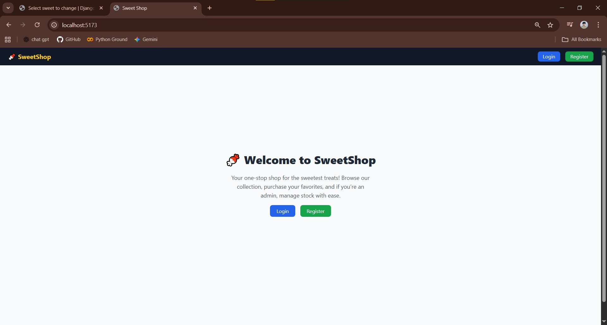
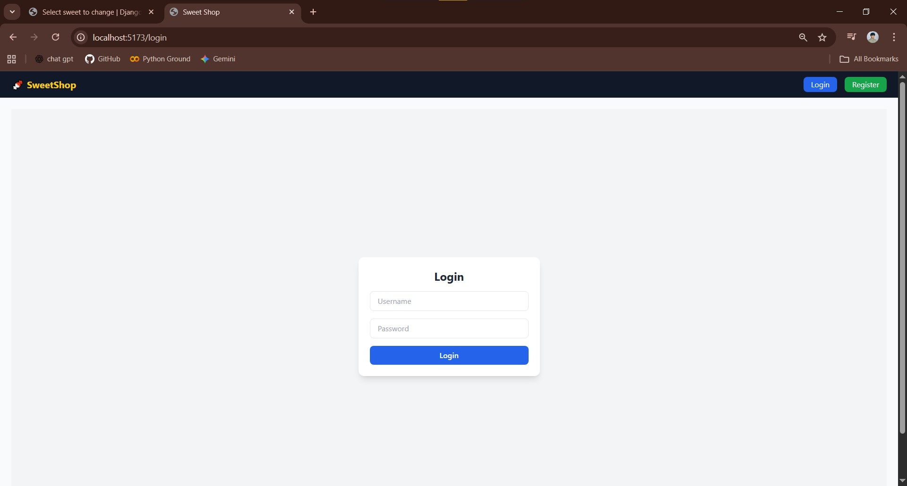
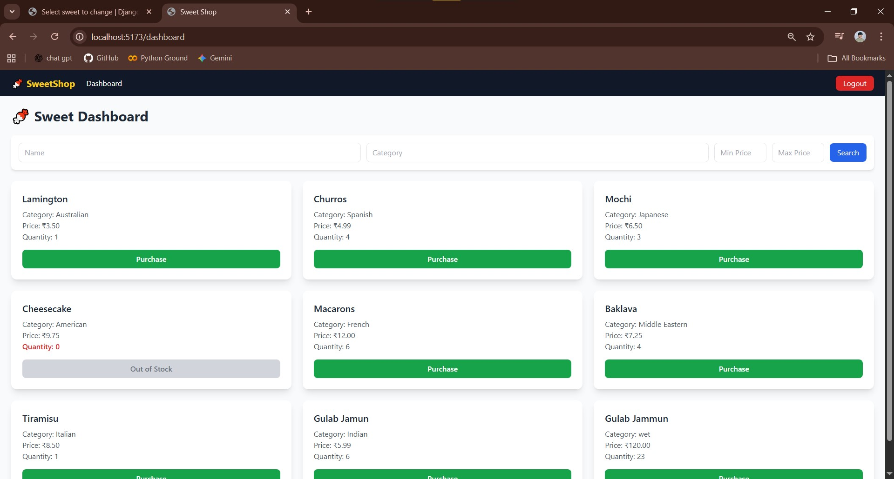
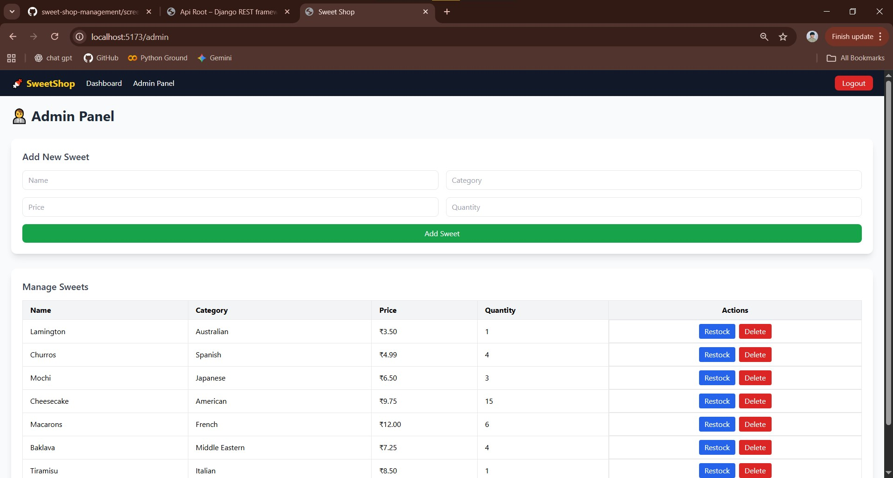

# SweetStore 🍬

> A full-stack web application to manage sweets inventory and purchases with role-based access for users and admins.

---

## Table of Contents
- [Project Description](#project-description)
- [Features](#features)
- [Tech Stack](#tech-stack)
- [Setup Instructions](#setup-instructions)
  - [Backend Setup](#backend-setup)
  - [Frontend Setup](#frontend-setup)
- [Running Tests](#running-tests)
- [Screenshots](#screenshots)
- [AI Usage](#ai-usage)
- [License](#license)

---

## Project Description
SweetStore is a responsive web application built with **Django (SQLite)** for the backend and **React** for the frontend.  
It allows users to browse and purchase sweets, while admins can manage inventory, restock items, and monitor sales.  
The app features **JWT authentication**, role-based access, and a clean, interactive UI.

---

## Features

### Backend
- ✅ User registration & login with JWT authentication
- ✅ Role-based access (user vs admin)
- ✅ CRUD operations for sweets
- ✅ Purchase and restock functionality
- ✅ Search and filter by name, category, and price range
- ✅ Swagger API documentation
- ✅ Fully tested endpoints

### Frontend
- ✅ Responsive React UI with TailwindCSS
- ✅ Role-based redirects (admin → `/admin`, users → `/dashboard`)
- ✅ Navbar with authentication-aware links
- ✅ Dashboard with search/filter, responsive cards, and purchase button
- ✅ Admin Panel: add, update, delete, and restock sweets
- ✅ Landing Page with call-to-action buttons

---

## Tech Stack
- **Frontend:** React, Vite, TailwindCSS, Axios, React Router
- **Backend:** Django, Django REST Framework, SQLite, JWT
- **Testing:** Django test framework, React Testing Library
- **Other Tools:** Swagger for API documentation

---

## Setup Instructions

### Backend Setup
1. Clone the repository:
   ```bash
   git clone <your-repo-url>
   cd backend

2. Create a virtual environment and activate it:
    python -m venv venv
    source venv/bin/activate  # Linux/macOS
    venv\Scripts\activate     # Windows

3. Install dependencies:
    pip install -r requirements.txt

4. Apply migrations:
    python manage.py migrate

5. Create a superuser (admin):
    python manage.py createsuperuser

6. Run the server:
    python manage.py runserver

7. API docs available at:
    http://localhost:8000/swagger/
    


### Frontend Setup
1. Navigate to the frontend folder:
   cd ../frontend

2. Install dependencies:
    npm install

3. Start the development server:
    npm run dev

4. Open your browser at:
    http://localhost:5173


### Running Tests
1. Backend:
    cd backend
    python manage.py test
2. Frontend:
    cd frontend
    npm test


## Screenshots

**Landing Page**  


**Login Page**  


**Dashboard**  


**Admin Panel**  



## AI Usage

This project was assisted by **ChatGPT** in the following ways:

- **Project structure:** Helped design the React + Django folder/file layout.
- **Frontend components:** Wrote React components, forms, tables, and connected them to API endpoints.
- **Backend guidance:** Helped with Django views, serializers, and JWT authentication setup.
- **Debugging & UX:** Suggested fixes for frontend errors, role-based redirects, and UX improvements.
- **Documentation:** Assisted in writing this README.md, setup instructions, and instructions for tests.

> Note: AI was used as a coding assistant. All business logic and final implementation were verified and customized manually.
